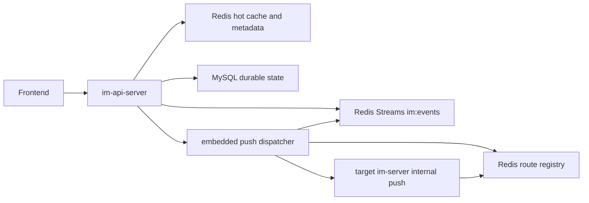

# Unified Rust Backend API

`im-api-server` now owns the auth, file, user and message HTTP surface. `im-server`
remains the only separate runtime service for WebSocket fanout and presence.

## Runtime Topology



Message fanout uses Redis Streams as the fixed event bus. `im-server` instances
do not consume the stream directly; they register themselves and their local
user sessions in Redis. The `im-api-server` dispatcher consumes `im:events`,
resolves `user_id -> im-server` from its local cache backed by Redis, and calls
`POST /api/im/internal/push` on the target `im-server`.

## Public API

| Area | Methods |
| --- | --- |
| Health | `GET /health`, `GET /ready` |
| Auth | `POST /auth/refresh`, `POST /api/auth/refresh`, `POST /auth/parse`, `POST /api/auth/parse`, `POST /auth/ws-ticket`, `POST /api/auth/ws-ticket` |
| User | `POST /user/register`, `POST /api/user/register`, `POST /user/login`, `POST /api/user/login`, `POST /user/logout`, `POST /api/user/logout`, `PUT /user/profile`, `PUT /api/user/profile`, `GET /user/search`, `GET /api/user/search`, `POST /user/heartbeat`, `POST /api/user/heartbeat`, `POST /user/online-status`, `POST /api/user/online-status`, `GET /user/settings`, `GET /api/user/settings`, `PUT /user/settings/:kind`, `PUT /api/user/settings/:kind` |
| File | `POST /file/upload/image`, `POST /file/upload/file`, `POST /file/upload/audio`, `POST /file/upload/video`, `POST /file/upload/avatar`, the same paths under `/api/file`, `GET|POST /file/download`, `GET|POST /api/file/download`, `POST /file/info`, `POST /api/file/info`, `DELETE /file/delete`, `DELETE /api/file/delete` |
| Message | `GET /message/config`, `GET /api/message/config`, `POST /message/send/private`, `POST /api/message/send/private`, `POST /message/send/group`, `POST /api/message/send/group`, `POST /message/read/:conversation_id`, `POST /api/message/read/:conversation_id`, `POST /message/recall/:message_id`, `POST /api/message/recall/:message_id`, `POST /message/delete/:message_id`, `POST /api/message/delete/:message_id`, `GET /message/conversations`, `GET /api/message/conversations`, `GET /message/private/:peer_id`, `GET /api/message/private/:peer_id`, `GET /message/group/:group_id`, `GET /api/message/group/:group_id` |
| WebSocket | `GET /websocket/:user_id` with access token and short-lived ws ticket |

## Internal API

Internal endpoints are still protected by HMAC headers and are now served by
`im-api-server`:

| Method | Path |
| --- | --- |
| `POST` | `/api/auth/internal/token` |
| `GET` | `/api/auth/internal/user-resource/:user_id` |
| `POST` | `/api/auth/internal/validate-token` |
| `POST` | `/api/auth/internal/introspect` |
| `POST` | `/api/auth/internal/ws-introspect` |
| `POST` | `/api/auth/internal/check-permission` |
| `POST` | `/api/auth/internal/revoke-token` |
| `POST` | `/api/auth/internal/revoke-user-tokens/:user_id` |
| `POST` | `/api/auth/internal/ws-ticket/consume` |

`im-server` also exposes an HMAC-protected push endpoint for the embedded
dispatcher:

| Method | Path |
| --- | --- |
| `POST` | `/api/im/internal/push` |

## IM Server Scaling

Each `im-server` periodically writes:

```text
im:server:{server_id} -> { serverId, internalHttpUrl, internalWsUrl, sessionCount, expiresAtEpochMs }
im:route:users[user_id] -> { server_id -> { sessionCount, internalHttpUrl, internalWsUrl, expiresAtEpochMs } }
```

To add nodes at runtime, start another `im-server` with a distinct
`IM_INSTANCE_ID`, `IM_INTERNAL_HTTP_URL`, and `IM_INTERNAL_WS_URL`. Existing
WebSocket connections stay where they are; new connections are routed through
`im-api-server` to the least-loaded registered node. The dispatcher uses the
user route table for precise push delivery.

## Full Test Harness

Run the full backend simulation after the stack is up:

```powershell
python scripts/full_backend_api_test.py
```

The script registers users, logs in, refreshes/parses tokens, tests internal
auth, seeds friend/group data, opens WebSockets through the API gateway,
verifies Redis Streams dispatcher push delivery, sends private and group messages,
marks read, recalls/deletes messages, uploads/downloads/deletes files, and
checks settings and presence.
